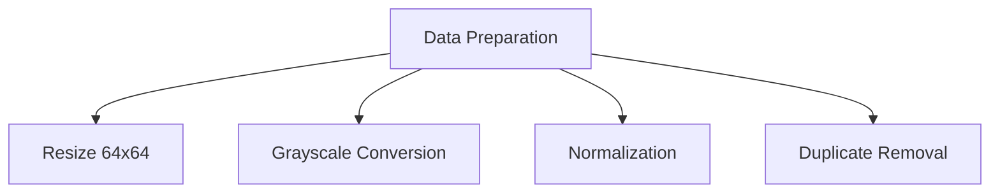
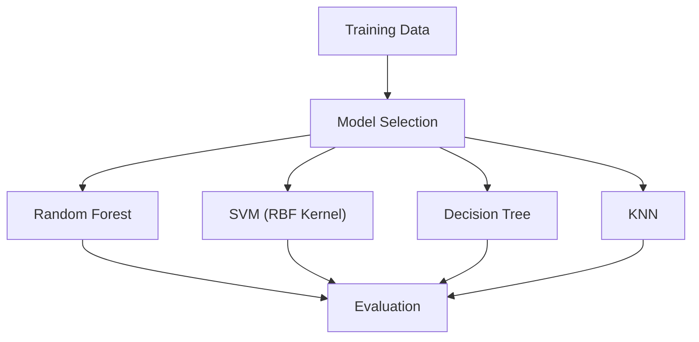
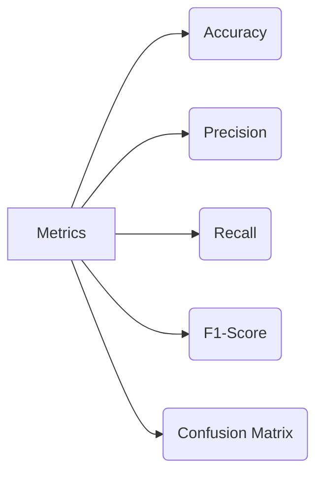
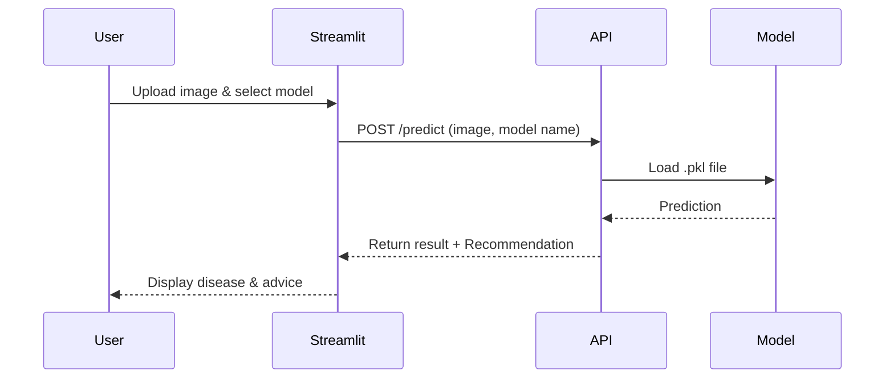
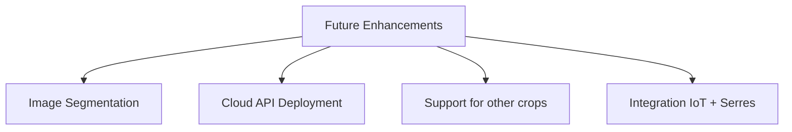

# 📊 Détection de Maladies des Plantes avec ML 

---

## 1. Business Understanding
- **But** : Détecter automatiquement les maladies de plantes avec un modèle ML accessible via API et une interface Streamlit.
- **Objectif** : Aider les agriculteurs à identifier rapidement les maladies pour agir rapidement.

---

## 2. Data Understanding
- **Dataset utilisé** : [PlantVillage](https://www.kaggle.com/datasets/emmarex/plantdisease)
- **Contenu** :  
  - 15 classes différentes de feuilles malades et saines
  - Exemples : *Tomato_Leaf_Mold*, *Potato_Late_blight*, *Tomato_healthy*.

---

## 3. Data Preparation

- Redimensionnement des images (64x64)
- Conversion en niveaux de gris
- Normalisation des pixels
- Suppression des doublons

---

## 4. Modeling

- **Modèles entraînés** : Random Forest, SVM, Decision Tree, KNN.
- **Technologies** : Scikit-learn, NumPy, Joblib pour sauvegarde.
- **Splitting** : 80% entraînement, 20% test.

---

## 5. Evaluation

- **Résultats principaux** :
  - SVM ~ 64% Accuracy
  - Random Forest ~ 63% Accuracy
- **Analyse** :
  - SVM et RF plus robustes, KNN/DT sur-ajustement.

---

## 6. Deployment

- **API Flask** (`api.py`) : `/predict` endpoint
- **Interface Streamlit** (`app.py`) :
  - Upload d'image
  - Sélection du modèle
  - Affichage du résultat
- **Recommandations intégrées** selon la maladie détectée.

---

## 7. Future Work

- Segmentation d'images pour identifier la zone malade
- Déploiement sur Render/HuggingFace Spaces
- Extension aux cultures de blé, maïs, etc.
- Fusion avec capteurs dans des serres automatisées

---

## 8. Team and Acknowledgment
- **Étudiants** :
  - Binta Ball
  - Eya Zantour
- **Encadrant** : Khemais Abdallah
- **Année** : 2025, Projet de 4ᵉ année (Génie Informatique, spécialisation Data Science & IA)

---

